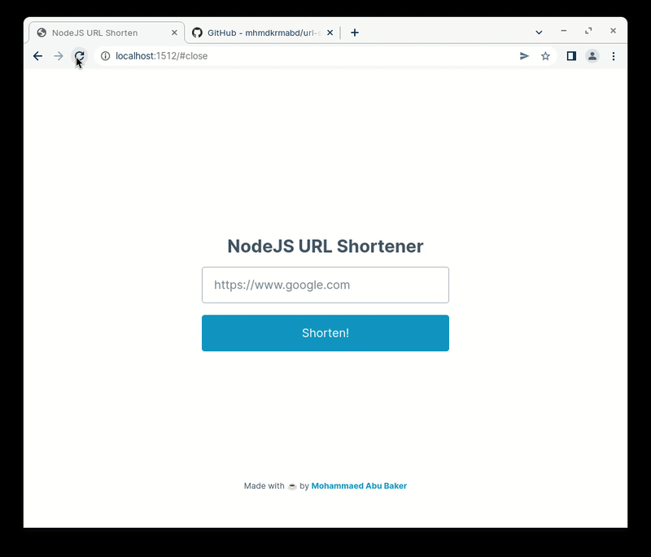

# NodeJS URL Shortener



    A simple yet very interesting Node URL shortener server project, used to locally shorten links for your own purposes! It doesn't need any preconfiguration for database it's shipped with the source code.

### How to run it

    In order to run the project, you need [Node.js](https://nodejs.org/en/), and [NPM](https://www.npmjs.com), after that, clone or download the source code, while your terminal is pointing at the source code folder run the following command:

```bash
npm i
```

If everything went well, just run this:

```bash
npm start
```

And that's it! 🥳

### Change the port

    Inside [`index.js`](https://github.com/mhmdkrmabd/url-shortener/blob/main/index.js#L8), there's a constant variable called `Port`, change the value to any port number that suits you.

### Bonus tip

    The server should be reachable throught something like `localhost:1512`, but we may edit the `hosts` file and instead of `localhost` we could be able to use `s.s:1512`, give it a try and happy learning!
